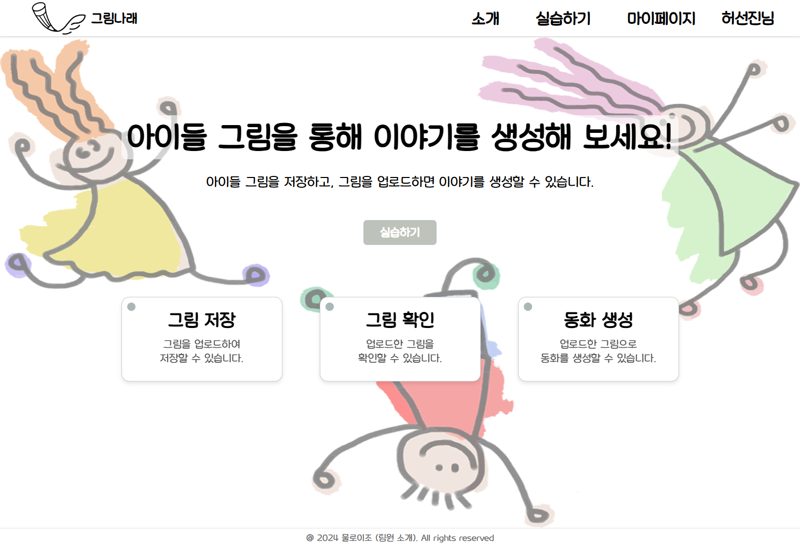
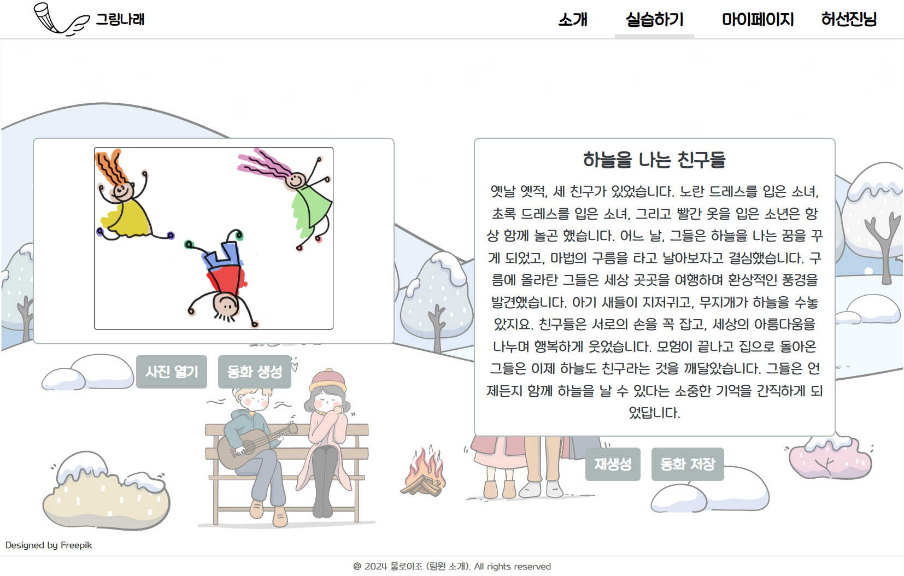
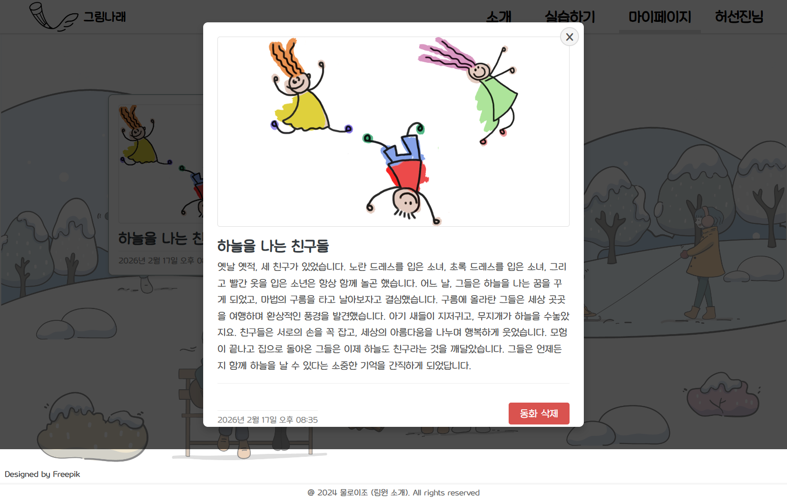

# 그림나래 (Image to Story) (Frontend - React)
그림을 업로드하면 AI가 자동으로 동화를 생성해주는 웹 서비스입니다.

그림을 디지털로 업로드하면, AI가 그림의 주제를 분석하여 동화를 자동으로 생성합니다. 생성된 동화는 저장하고 마이페이지에서 언제든지 다시 확인할 수 있습니다.

## 주요 기능
- JWT 기반 회원가입 / 로그인 (Access Token + Refresh Token)
- 이미지 업로드 및 동화 생성
- 생성된 동화 저장 및 관리
- 마이페이지에서 저장된 동화 목록 조회 / 상세 확인 / 삭제

## 주요 화면

### 홈 화면


### 그림 업로드 및 동화 생성


### 마이페이지


## 🛠️ 기술 스택
- **Framework**: React 18
- **Language**: TypeScript
- **Build Tool**: Vite
- **Styling**: styled-components
- **Routing**: React Router DOM v6
- **State Management**: Jotai
- **Auth**: JWT (Access Token + Refresh Token / HttpOnly Cookie)

## 📁 프로젝트 구조
```
src/
├── api/              # API 통신 모듈
│   ├── api.ts        # authenticatedFetch (토큰 자동 갱신 포함)
│   ├── auth.ts       # 로그인, 회원가입, 로그아웃, 토큰 갱신
│   ├── story.ts      # 이미지 업로드, 동화 저장/조회/삭제
│   └── token.ts      # Access Token 메모리 + localStorage 관리
├── components/       # 공통 컴포넌트 (Header, Footer)
├── pages/            # 페이지 컴포넌트
│   ├── Home.tsx          # 홈 화면
│   ├── GetStarted.tsx    # 이미지 업로드 및 동화 생성
│   ├── MyPage.tsx        # 내 동화 목록 및 상세 조회
│   ├── Login.tsx         # 로그인
│   ├── SignUp.tsx        # 회원가입
│   ├── Introduce.tsx     # 서비스 소개
│   ├── Team.tsx          # 팀원 소개
│   ├── FindId.tsx        # 아이디 찾기 (구현 예정)
│   └── FindPw.tsx        # 비밀번호 찾기 (구현 예정)
├── state/            # Jotai 전역 상태
├── types/            # TypeScript 타입 정의
├── photos/           # 이미지 에셋
├── theme.tsx         # 컬러 팔레트
└── App.tsx           # 라우팅 및 인증 초기화
```

## 💡 핵심 구현 사항
### 1. 이미지 기반 AI 동화 생성
- 사용자가 업로드한 이미지를 FormData로 백엔드에 전송
- AI가 이미지를 분석하여 제목과 본문이 포함된 동화를 자동 생성
- 결과가 마음에 들지 않을 경우 재생성 버튼으로 새로운 동화 생성 가능

### 2. 동화 저장 및 관리
- 생성된 동화를 이미지와 함께 서버에 저장
- 마이페이지에서 그리드 형식의 카드 목록으로 저장된 동화 일괄 조회
- 카드 클릭 시 모달로 이미지, 제목, 내용, 저장 날짜를 상세 확인
- 개별 동화 삭제 기능 (삭제 전 재확인 알림 포함)

### 3. 반응형 UI
- `@media (max-width: 768px)` 기반 모바일 대응 레이아웃 적용
- styled-components를 활용한 컴포넌트 단위 스타일 관리

## 🚀 시작하기
### 1. 의존성 설치
```bash
npm install
```

### 2. 환경변수 설정
`.env.example` 파일을 참고하여 `.env` 파일을 생성합니다.
```env
VITE_API_BASE_URL=http://localhost:3000
```

### 3. 서버 실행
```bash
npm run dev
```

서버가 정상적으로 실행되면 브라우저에서 `http://localhost:5173` 접속

### 주의사항
- 백엔드 서버가 먼저 실행되어 있어야 합니다
- `.env` 파일은 절대 Git에 커밋하지 마세요
- Refresh Token은 HttpOnly Cookie로 관리되므로, 백엔드에서 CORS 및 Cookie 설정이 올바르게 되어 있어야 합니다

## 저장소
본 프로젝트는 2개의 저장소로 구성되어 있습니다:

- **프론트엔드 (React)** - 현재 저장소

- **백엔드 (Node.js)** - https://github.com/HeoSeonJin0504/image-to-story-node.git
  
## 팀원 소개
| 이름 | 역할 | GitHub |
|------|------|--------|
| 임희진 | AI, 백엔드 | [@hanataba227](https://github.com/hanataba227) |
| 송진우 | DB, 서버 개발 | [@ssong77](https://github.com/ssong77) |
| 허선진 | 프론트엔드, 백엔드 리팩토링 | [@HeoSeonJin0504](https://github.com/HeoSeonJin0504) |
| 김소희 | HW 관리, 디자인 | [@shkim429](https://github.com/shkim429) |

---

© 2024 물로이조. All rights reserved.